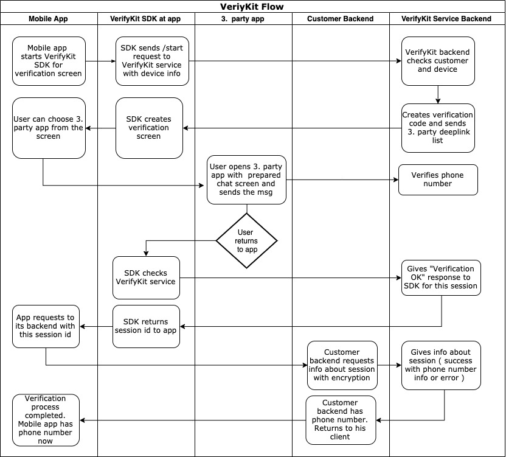

# VerifyKit
[](#installation)
[](https://jitpack.io/#org.bitbucket.verifykit/verifykit-android)
[](https://android-arsenal.com/api?level=14)


VerifyKit is the next generation phone number validation system. Users can easily verify their phone numbers without the need of entering phone number or a pin code.
## How It Works?
1. Register your app at https://www.verifykit.com and get your client keys and server key. 
2. Add VerifyKit SDK to your app
3. Configure and start VerifyKit SDK
4. When verification completed, send "sessionId" which VeriyfKit SDK gives you to your backend service
5. At your server side, get user's phone number from VerifyKit service wtih "serverKey" and sessionId. You can check [Backend Integration](#backend-integration)

## Security
"ServerKey" are used for getting info from VerifyKit service.
Please keep "ServerKey" safe. Do not include your client's code base.
## Installation
Add it to your app build.gradle at the end of repositories:
```groovy
implementation 'org.bitbucket.verifykit:verifykit-android:${lastVersion}'
```
Add it to your root build.gradle at the end of repositories:
```groovy
allprojects {
  repositories {
    ...
    maven { url 'https://jitpack.io' }
  }
}
```
## Requirements
Minimum SDK Version is  api 14
## Usage
In your Application file you should initialize VerifyKit. VerifyKit.init() method needs VerifyKitOptions object. 

Application.kt
```kotlin
  val theme = VerifyKitTheme(
            backgroundColor = Color.WHITE,
            toolbarTitle = getString(R.string.app_name)
        )
        VerifyKit.init(
            this,
            VerifyKitOptions(
                isLogEnabled = true,
                verifyKitTheme = theme
            )
        )
```
You can call VerifyKit.startVerification(this) method from your Activity or Fragment then get the result via VerifyCompleteListener interface from your Activity or Fragment.
```kotlin
 VerifyKit.startVerification(this, object : VerifyCompleteListener {
            override fun onSuccess(sessionId: String) {
              // TODO operate SUCCESS process
            }
            override fun onFail(error: VerifyKitError) {
              // TODO operate FAIL process
            }
        })
```

You must pass the result to VerifyKit.onActivityResult 
```kotlin
  override fun onActivityResult(requestCode: Int, resultCode: Int, data: Intent?) {
        super.onActivityResult(requestCode, resultCode, data)
        VerifyKit.onActivityResult(requestCode, resultCode, data)
    }
```
There may be a case when user chooses a third party messaging app for validation, sends a message, but doesn't return to main app and kills it. In that case, that user is verified with VerifyKit but the main app doesn't know it yet.

To fix this, we have a method to check interrupted session status.
```kotlin
VerifyKit.checkInterruptedSession(applicationContext, object : VerifyCompleteListener {
            override fun onSuccess(sessionId: String) {
                // sessionId
            }
            override fun onFail(error: VerifyKitError) {
                // error
            }
        })
```
## AndroidManifest
Open the /app/manifest/AndroidManifest.xml file.

Add the following meta-data elements, an activity for VerifyKit and intent filter for App Link inside your application element:
```xml
<meta-data
            android:name="com.verifykit.sdk.clientKey"
            android:value="your_verifykit_client_key" />
<meta-data
            android:name="com.verifykit.sdk.clientSecret"
            android:value="your_verifykit_client_secret" />
<activity
            android:name="com.verifykit.sdk.ui.VerificationActivity"
            android:launchMode="singleInstance"
            android:screenOrientation="portrait">
	<intent-filter android:autoVerify="true">
		<action android:name="android.intent.action.VIEW" />
		<category android:name="android.intent.category.DEFAULT" />
		<category android:name="android.intent.category.BROWSABLE" />
		<data
                    android:host="your_deep_link_url"
                    android:pathPattern="your_deep_link_pattern"
                    android:scheme="https" />
	</intent-filter>
</activity>
```
An Android App Link is a deep link based on your website URL that has been verified to belong to your website. So clicking one of these immediately opens your app if it's installed—the disambiguation dialog does not appear. Though the user may later change their preference for handling these links.
For verifying your App Link see 
[document](https://developer.android.com/training/app-links/verify-site-associations)

## ProGuard
```
-keep class com.verifykit.sdk.** { *; }
```

## Backend Integration

Depending on the language you use in your backend service, you can use one of the following options.

You can use our [php-sdk](https://github.com/verifykit/verifykit-sdk-php/blob/master/README.md) like this; 

```php
$vfk = new \VerifyKit\VerifyKit($serverKey);

/** @var \VerifyKit\Entity\Response $result */
$result = $vfk->getResult($sessionId);

if ($result->isSuccess()) {
    echo "Phone number : " . $result->getPhoneNumber() .
        ", Validation Type : " . $result->getValidationType() .
        ", Validation Date : " . $result->getValidationDate()->format('Y-m-d H:i:s') . PHP_EOL;
} else {
    echo "Error message : " . $result->getErrorMessage() . ", error code : " . $result->getErrorCode() . PHP_EOL;
}
```

You can use our [python-sdk](https://github.com/verifykit/verifykit-sdk-python/blob/master/README.md) like this; 

```python

from VerifyKit import Verify

verify = Verify(server_key="{SERVER-KEY}")
verify.validation(session_id='{SESSION-ID}')

if verify.is_valid:
    #Validation success.
    print(verify.response())

elif verify.is_valid == False:
    #Validation fail.
    print(verify.response())
 
```

Or you can use curl request like this;

```bash
curl --location --request POST 'https://api.verifykit.com/v1.0/result' \
--header 'X-Vfk-Server-Key:{SERVER-KEY}' \
--header 'Content-Type: application/json' \
--form 'sessionId={{SESSION-ID}}’
```

---

## Support

If you have any questions or requests, feel free to [create an issue](https://github.com/verifykit/verifykit-sdk-android/issues).

## Author

VerifyKit is owned and maintained by 
[VerifyKit DevTeam.](mailto:sdk@verifykit.com)


## License
[MIT](https://opensource.org/licenses/MIT)

Copyright (c) 2019-2020 VerifyKit. [https://verifykit.com](http://verifykit.com)

Permission is hereby granted, free of charge, to any person obtaining a copy of this software and associated documentation files (the "Software"), to deal in the Software without restriction, including without limitation the rights to use, copy, modify, merge, publish, distribute, sublicense, and/or sell copies of the Software, and to permit persons to whom the Software is furnished to do so, subject to the following conditions:

The above copyright notice and this permission notice shall be included in all copies or substantial portions of the Software.

THE SOFTWARE IS PROVIDED "AS IS", WITHOUT WARRANTY OF ANY KIND, EXPRESS OR IMPLIED, INCLUDING BUT NOT LIMITED TO THE WARRANTIES OF MERCHANTABILITY, FITNESS FOR A PARTICULAR PURPOSE AND NONINFRINGEMENT. IN NO EVENT SHALL THE AUTHORS OR COPYRIGHT HOLDERS BE LIABLE FOR ANY CLAIM, DAMAGES OR OTHER LIABILITY, WHETHER IN AN ACTION OF CONTRACT, TORT OR OTHERWISE, ARISING FROM, OUT OF OR IN CONNECTION WITH THE SOFTWARE OR THE USE OR OTHER DEALINGS IN THE SOFTWARE.
